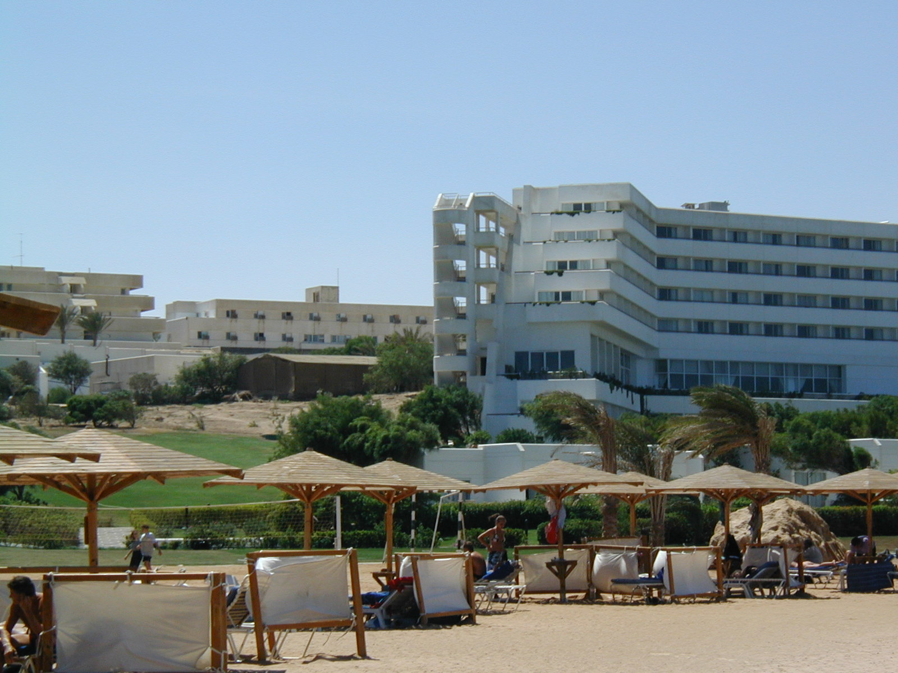
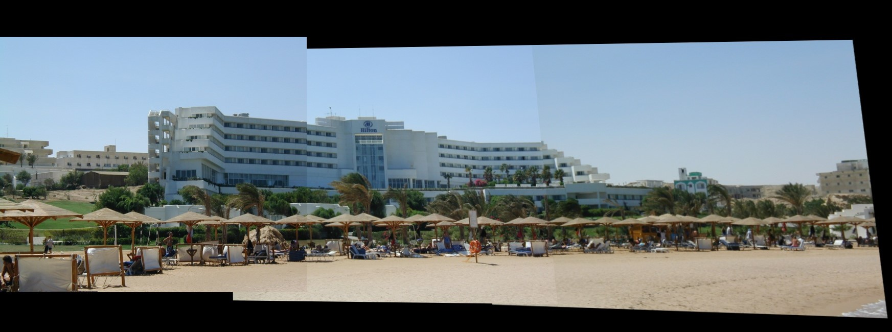
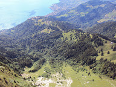
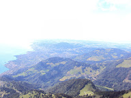
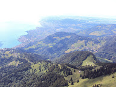
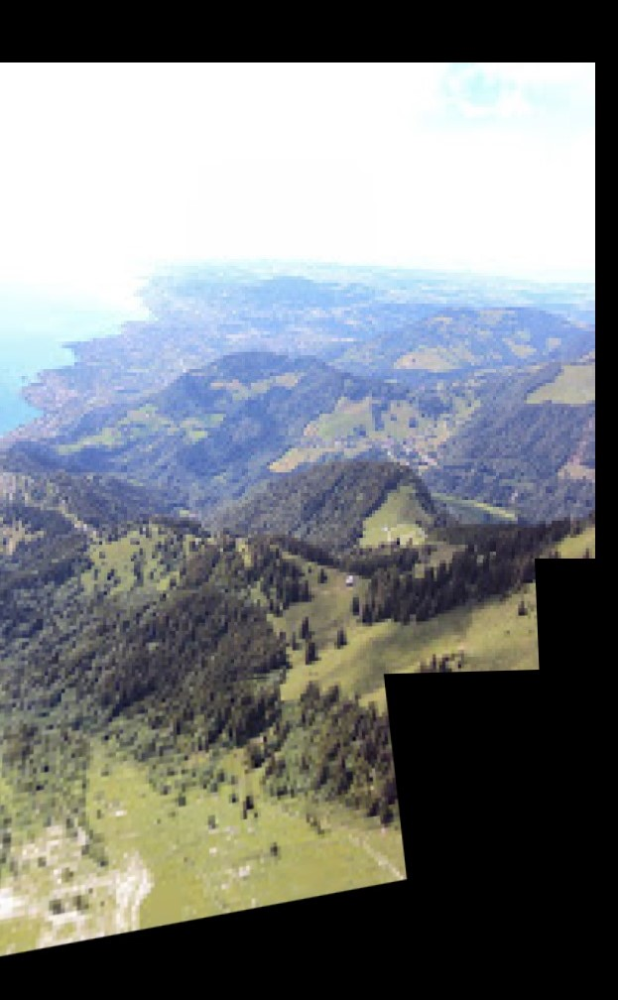

# Panorama_stitching
This project stitches all the images in a folder if they overlap

# How to run:

1. Run "stitch.py" with name of the folder containing images to be stitched as argument

# Sample 1

Input images:

Stitched panorama:

# Sample 2

